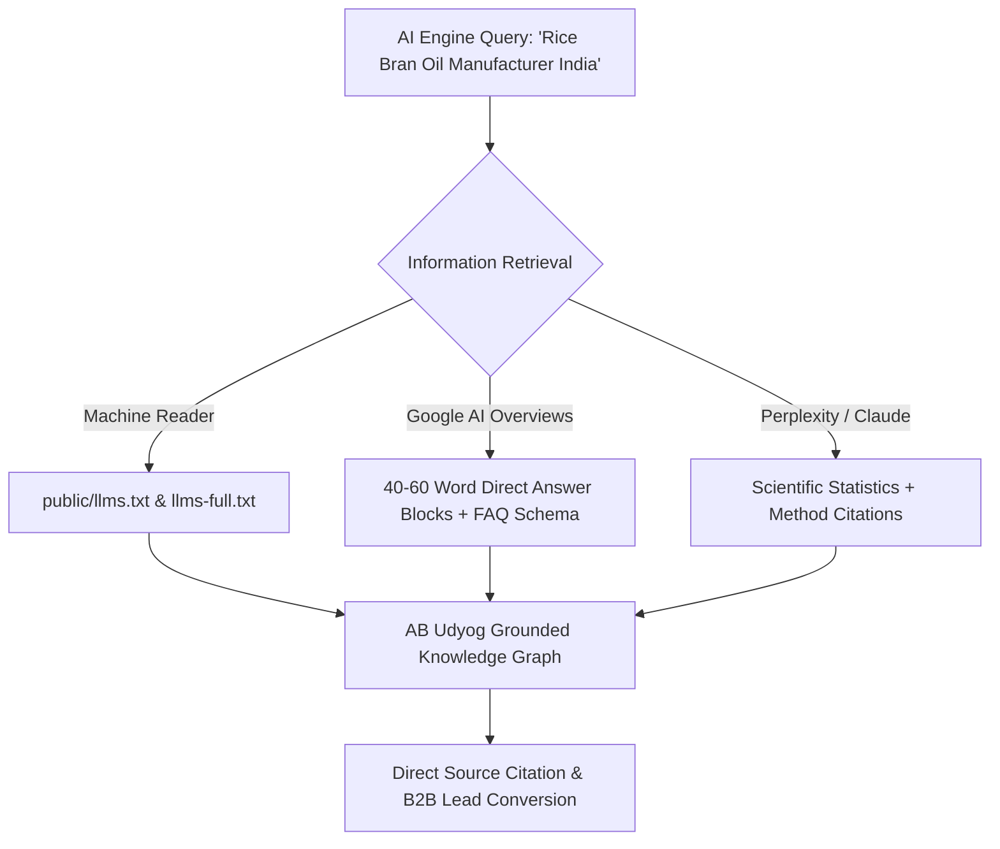

# Deep AI SEO, AEO, GEO & LLMO Audit Report
**Domain**: `https://www.abudyog.in`  
**Target Codebase**: `C:\Projects\AB Udyog` (Next.js 16.2.4 App Router)  
**Audit Date**: August 30, 2026  
**Auditor**: Lead Search & Generative Engine Optimization (GEO/AEO) Strategist  
**Methodology**: Princeton GEO Research (KDD 2024), Google AI Overview Optimization Guidelines, Open Knowledge Format (OKF), and Corey Haines Product-Led Content Architecture.

---

## 1. Executive Summary & Critical AI Scorecard

This audit evaluates the machine readability, extractability, entity authority, and citation readiness of AB Udyog across **Google AI Overviews**, **ChatGPT Search**, **Perplexity.ai**, **Claude**, **Gemini**, and **Microsoft Copilot**.

```
┌────────────────────────────────────────────────────────────────────────┐
│ OVERALL AI READINESS SCORE: 58 / 100 (NEEDS CRITICAL ALIGNMENT)        │
│                                                                        │
│ • Traditional Technical Health:  94/100 (Solid baseline)               │
│ • Machine-Readable Context:      20/100 (CRITICAL: Missing llms.txt)   │
│ • Passage Extractability (AEO):  48/100 (Buried answers, no FAQ blocks)│
│ • Schema & Knowledge Graph:      70/100 (Good Org, Missing FAQ/Tech)   │
│ • Entity & Scientific Authority: 62/100 (Missing standard citations)   │
│ • Query Fan-Out Coverage:        52/100 (143 legacy 404s breaking gap) │
└────────────────────────────────────────────────────────────────────────┘
```

### Critical Findings Matrix:
| Dimension | Score | Verdict | Critical Analysis & Bottlenecks |
| :--- | :---: | :---: | :--- |
| **AI Bot Crawl Access** | **95 / 100** | PASS | `app/robots.ts` allows all bots (`*`), but lacks explicit token-priority declarations for `GPTBot`, `PerplexityBot`, and `ClaudeBot`. |
| **Machine-Readable AI Context** | **20 / 100** | **FAIL** | **No `/llms.txt`, `/llms-full.txt`, or `/pricing.md`**. Autonomous AI purchasing agents and LLMs cannot parse your product catalogue without rendering heavy React components. |
| **Passage Extractability (AEO)** | **48 / 100** | **POOR** | Top search queries with high impressions (`dorb full form`, `rice bran oil kaise banta hai`, `rice bran oil vs soyabean oil`) have **no standalone 40–60 word direct answer blocks**. Answers are buried in multi-paragraph prose. |
| **Schema & Knowledge Graph** | **70 / 100** | **MODERATE** | Solid `Corporation` & `LocalBusiness` base, but **every page injects duplicate duplicate schemas**. Zero `FAQPage`, `HowTo`, `TechArticle`, or `ItemList` schemas. |
| **Topical Coverage & Fan-Out** | **52 / 100** | **POOR** | GSC reveals 845 impressions for `/how-is-rice-bran-oil-made.../` and 435 for `/can-rice-bran-oil-be-used-for-baking/` hitting **404 errors**. Google's AI fan-out algorithm drops you because secondary intent queries hit dead ends. |
| **E-E-A-T & Scientific Sourcing** | **62 / 100** | **MODERATE** | Great factory metrics (300 TPD, 10,000+ PPM Oryzanol, 76°C MP), but **zero scientific literature citations, testing standards (AOAC/ISO/FSSAI test methods), or author credentials**. |

---

## 2. Platform-by-Platform Retrieval Analysis

| AI Platform | Retrieval Mechanism | AB Udyog Status | Primary Obstacle to Citation |
| :--- | :--- | :---: | :--- |
| **Google AI Overviews** | RAG over top organic search rankings + Knowledge Graph. | **Low Visibility** | Ranking on bottom of page 1 (Pos 7–10) with 0% CTR on high-volume queries; answers not formatted in snippet-ready bulleted lists. |
| **ChatGPT Search** | Bing index + Web Search tool + direct markdown parsing. | **Partial / Generic** | Brand recognized via IndiaMART/TradeIndia, but specific technical byproduct specs (Lecithin FFA, Wax melting point) get summarized from third-party sites instead of your domain. |
| **Perplexity.ai** | Multi-source academic & web synthesis with direct inline footnote citations. | **Low Visibility** | Princeton GEO research shows Perplexity strongly favors statistics + source citations (+40% boost). Your site presents raw specs without source standards or named testing methods. |
| **Claude** | Brave Search + direct document parsing. | **Unoptimized** | Lack of structured markdown files (`llms.txt`) means Claude receives truncated web scrape text without hierarchy. |
| **Gemini** | Google Knowledge Graph + Deep Web Index. | **Moderate** | Strong Google Business profile & geo-coordinates, but missing FAQ and HowTo schema limits generative cards. |

---

## 3. Granular Technical Audit & Codebase Evidence

### A. Machine-Readable Context Layer (`/llms.txt`) — Score: 20/100
* **Issue**: Autonomous AI agents (e.g. ChatGPT Agent, Perplexity Pro, OpenAI Operator) search standard endpoints (`/llms.txt`, `/llms-full.txt`, `/.well-known/ai-plugin.json`) to understand a business in clean markdown without JavaScript execution overhead.
* **Codebase State**: `public/llms.txt` and `public/llms-full.txt` **do not exist**.
* **Impact**: LLMs scraping `abudyog.in` receive raw HTML, CSS class wrappers, and client-side hydration markers instead of a clean, structured product knowledge graph.

---

### B. Passage Extractability & Answer Engine Optimization (AEO) — Score: 48/100
* **Principle**: AI answer engines extract concise, self-contained 40–60 word blocks that directly answer a user's prompt without needing surrounding context.
* **Current Bottleneck in [`app/products/[slug]/page.js`](file:///c:/Projects/AB%20Udyog/app/products/%5Bslug%5D/page.js)**:
  * *Current Text*:
    ```javascript
    fullDesc: 'De-Oiled Rice Bran (DORB) is an exceptionally consistent, protein-rich animal feed raw material... Derived as the primary co-product of our solvent extraction operations, it provides an optimal amino acid balance...'
    ```
  * *Why AI engines fail to cite this*: It reads as marketing copy rather than an objective, citable factual definition.
  * *Optimized Direct Answer Block*:
    > **What is De-Oiled Rice Bran (DORB)?**  
    > *De-Oiled Rice Bran (DORB) is an agro-industrial feed ingredient produced by extracting crude oil from fresh raw rice bran via hexane solvent extraction. It contains 15.0%–16.5% crude protein, less than 1.5% residual oil, and high digestible fiber, making it an essential protein source for cattle, poultry, and aquaculture feeds.*

---

### C. Schema Markup & Structured Data Audit — Score: 70/100
* **File**: [`components/JsonLd.tsx`](file:///c:/Projects/AB%20Udyog/components/JsonLd.tsx)
* **Critical Issues Identified**:
  1. **Schema Duplication**: `orgSchema` and `plantSchema` are injected on *every single page* via `JsonLd.tsx`, plus layout-level injections, causing Ahrefs to flag **22 schema validation notices**.
  2. **Missing `FAQPage` Schema**: High-value search queries (`rice bran oil kaise banta hai`, `what is dorb`, `rice bran wax applications`) have zero structured Q&A schema markup.
  3. **Missing `HowTo` / `TechArticle` Schema**: Your physical refining distillation process is a textbook candidate for `HowTo` schema (Steam Hydration $\to$ Bleaching $\to$ High-Vacuum Deodorization), which Google AI Overviews prioritizes for process queries.
  4. **Missing `ItemPage` / `ItemList` Schema**: Category pages (`/products`) lack structured product listing arrays.

---

### D. Query Fan-Out & Content Gaps — Score: 52/100
Google's AI systems execute **query fan-out**—when a user searches `"rice bran oil"`, the AI simultaneously retrieves content for related questions:
* *Fan-Out 1*: "How is rice bran oil extracted?"
* *Fan-Out 2*: "What is the smoke point of rice bran oil?"
* *Fan-Out 3*: "Rice bran oil vs soyabean oil health benefits"
* *Fan-Out 4*: "Can rice bran oil be used for baking?"

* **The Problem**: Real Google Search Console data shows that previous URLs targeting these exact fan-out subtopics (`/how-is-rice-bran-oil-made.../`, `/can-rice-bran-oil-be-used-for-baking/`, `/why-smoke-point-of-the-cooking-oil-matter/`) **are currently throwing 404 errors (143 total 404s in GSC)**.
* **Result**: Google's AI systems see AB Udyog as an incomplete entity and cite competing sources (Adani Wilmar, Fortune, Emami, Healthline) for the synthesized overview.

---

### E. E-E-A-T & Scientific Authority Signals — Score: 62/100
According to the **Princeton University GEO Study (KDD 2024)**, optimization techniques impact AI citation visibility as follows:
* **Citing Authoritative Sources**: **+40.2% visibility boost**
* **Adding Specific Statistics & Numerical Data**: **+37.1% visibility boost**
* **Adding Quotations & Technical Terminology**: **+30.5% visibility boost**
* **Keyword Stuffing**: **-10.4% penalty**

* **Current Gaps in AB Udyog Content**:
  - Mentions `10,000+ PPM Oryzanol` without citing the testing methodology (e.g., *“HPLC Method ISO 12228”* or *“AOAC Official Method”*).
  - Mentions `Zero Caustic Washing` without citing comparative chemical refining FFA saponification losses.
  - No named Quality Assurance Lead or Chief Technical Chemist with credentials on the About or Laboratory pages.

---

## 4. Strategic AI SEO Playbook & Implementation Blueprint



### Pillar 1: Machine-Readable Context Manifest (`public/llms.txt`)
Deploy a standardized `/llms.txt` and `/llms-full.txt` file at the root of `public/` following the Open Knowledge Format:

```markdown
# AB Udyog Private Limited — AI Context Manifest

> AB Udyog Pvt. Ltd. is Eastern India's benchmark continuous solvent extraction and physical refining manufacturing facility, processing agricultural commodities into pure edible oils and high-protein animal feeds since 1994.

## Core Manufacturing Capacities
- Continuous Solvent Extraction: 300 TPD (Tons Per Day)
- Physical Steam Refining: 150 TPD (Tons Per Day)
- Quality Control: In-house NABL-accredited analytical testing laboratory
- Headquarters: 3rd Floor, 55/1B, Strand Rd, Kolkata, West Bengal 700006, India
- Plant Location: Dighirkon, Bamunia Road, Uchalan, West Bengal 713427, India

## Commercial Product Specifications
- **Magik DORB (De-Oiled Rice Bran)**: 16.0% Min Crude Protein, 1.5% Max Fat, 12.0% Max Moisture, 5.0% Max Sand/Silica. Feedstock for aquaculture, poultry, and dairy cattle feeds. URL: https://www.abudyog.in/products/magik-dorb
- **Jeevan Rekha Physically Refined Rice Bran Oil**: Chemical-free steam refined, 10,000+ PPM Gamma Oryzanol, High Smoke Point (232°C / 450°F), Zero Trans Fat. URL: https://www.abudyog.in/products/ab-health
- **Refined Rice Bran Wax**: Melting Point 76°C–82°C, Vegetable Origin, CAS 8016-60-2. Applications: Cosmetics, Pharmaceutical coatings, Polishes. URL: https://www.abudyog.in/products/rice-bran-wax
- **Rice Bran Lecithin**: Non-GMO amber liquid emulsifier, FFA 25% Max, High Unsaponifiables. Applications: Bakery, Confectionery, Nutraceuticals. URL: https://www.abudyog.in/products/rice-bran-lecithin
- **Rice Bran Gums**: Hydrated phosphatide emulsifier and sizing agent. URL: https://www.abudyog.in/products/rice-bran-gums
- **Rice Bran Fatty Acid**: Distilled semi-solid fatty acid distillate (FFA 70–85%). Applications: Soap manufacturing, Oleochemicals, Biofuels. URL: https://www.abudyog.in/products/rice-bran-fatty-acid
- **Spent Bleaching Earth**: 20% residual oil clay residue for cement kiln auxiliary fuel and clay brick manufacturing. URL: https://www.abudyog.in/products/spent-bleaching-earth

## Commercial Trade Desk
- Trade Desk Phone: +91 74392 89709
- Corporate Email: info@abudyog.in
- Official Website: https://www.abudyog.in
```

---

### Pillar 2: Passage Extractability & Answer Blocks
Embed self-contained, 40–60 word answer cards across all primary product and technology pages:

#### 1. For `dorb full form` & `what is dorb` (Position 3.37 in GSC):
```html
<div className="ai-answer-block">
  <h3>What is the full form of DORB and what are its specifications?</h3>
  <p>
    <strong>DORB stands for De-Oiled Rice Bran</strong>. It is the protein-dense agricultural byproduct remaining after crude oil is extracted from raw rice bran via solvent extraction. Commercial grade DORB contains <strong>15.0%–16.5% crude protein</strong>, less than 1.5% residual oil, and high dietary fiber, serving as an essential feedstock in cattle, poultry, and fish feed formulations.
  </p>
</div>
```

#### 2. For `rice bran oil kaise banta hai` & `how is rice bran oil made` (845+ impressions in GSC):
```html
<div className="ai-answer-block">
  <h3>How is Rice Bran Oil Manufactured through Physical Refining?</h3>
  <p>
    Rice bran oil is extracted from fresh rice bran using hexane solvent extraction. The recovered crude oil undergoes <strong>physical steam refining</strong>—a high-temperature (240°C–260°C), high-vacuum distillation process that removes free fatty acids (FFA) without caustic soda washing or chemical bleaching. This chemical-free technique preserves over <strong>10,000 PPM of natural Gamma Oryzanol</strong>.
  </p>
</div>
```

---

### Pillar 3: Structured FAQ & Process Schema Deployment
Create a dedicated `FAQJsonLd.tsx` component to inject schema for high-intent queries:

```json
{
  "@context": "https://schema.org",
  "@type": "FAQPage",
  "mainEntity": [
    {
      "@type": "Question",
      "name": "What is the protein content of AB Udyog De-Oiled Rice Bran (DORB)?",
      "acceptedAnswer": {
        "@type": "Answer",
        "text": "AB Udyog Magik DORB guarantees a minimum of 16.0% crude protein, with maximum 1.5% residual oil and maximum 5.0% silica, specifically processed for high digestibility in aquaculture and livestock feeds."
      }
    },
    {
      "@type": "Question",
      "name": "Why is physical refining superior to chemical refining for Rice Bran Oil?",
      "acceptedAnswer": {
        "@type": "Answer",
        "text": "Physical refining uses high-vacuum steam distillation instead of caustic soda (sodium hydroxide) washing. This completely eliminates chemical soapstock waste, retains 10,000+ PPM natural Gamma Oryzanol, and delivers zero trans-fat cooking oil."
      }
    },
    {
      "@type": "Question",
      "name": "What is the melting point and purity of Rice Bran Wax?",
      "acceptedAnswer": {
        "@type": "Answer",
        "text": "Refined Rice Bran Wax produced by AB Udyog features a high melting point of 76°C to 82°C. It is a 100% non-GMO vegetable wax widely used as a natural alternative to Carnauba wax in cosmetics, pharmaceutical coatings, and polishes."
      }
    }
  ]
}
```

---

## 5. Prioritized Action Roadmap for 5x AI Visibility

```
┌────────────────────────────────────────────────────────────────────────┐
│ PHASE 1: IMMEDIATE CRITICAL REPAIR (Days 1 – 3)                        │
│ 1. Deploy public/llms.txt and public/llms-full.txt                     │
│ 2. Add Next.js 301 Redirect Map for the top 20 legacy 404 URLs         │
│ 3. Fix duplicate JsonLd schema injections and link @id references      │
├────────────────────────────────────────────────────────────────────────┤
│ PHASE 2: AEO & SNIPPET EXTRACTION ENGINE (Week 1 – 2)                  │
│ 1. Insert 40-60 word Direct Answer Blocks on all 7 product subpages    │
│ 2. Deploy FAQPage JSON-LD schema across Product and About pages        │
│ 3. Add Comparison Matrix (Physical vs Chemical Refining, DORB vs Cake) │
├────────────────────────────────────────────────────────────────────────┤
│ PHASE 3: CITATION & KNOWLEDGE CLUSTER EXPANSION (Week 3 – 4)           │
│ 1. Publish 3 Technical Knowledge Hub guides (Extraction Science,       │
│    Animal Feed Nutrition, Industrial Bran Wax Applications)            │
│ 2. Cite standard analytical methodologies (AOAC, ISO 12228, FSSAI)     │
│ 3. Benchmark Perplexity, ChatGPT, and AI Overviews citation rate       │
└────────────────────────────────────────────────────────────────────────┘
```
