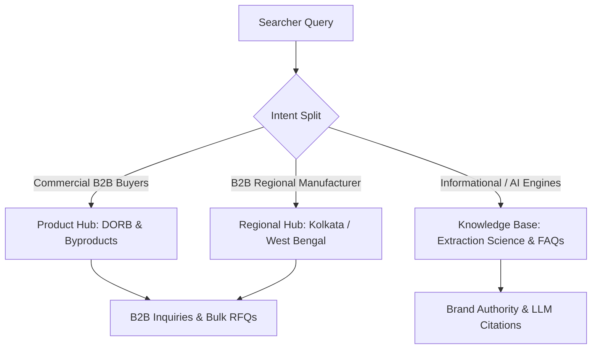

# AB Udyog Comprehensive Search Health, SEO, AEO, GEO & Growth Audit

**Domain**: `abudyog.in`  
**Audit Date**: August 30, 2026  
**Audited Datasets**: 
1. `abudyog.in-Performance-on-Search-2026-08-30.xlsx` (Google Search Console Performance)
2. `abudyog.in-Coverage-2026-08-30.xlsx` (Google Search Console Indexation & Coverage)
3. `abudyog.in-core-web-vitals-2026-08-30.xlsx` (Google Search Console CWV Experience)
4. `abudyog.in-Breadcrumbs-2026-08-30.xlsx` (Google Search Console Structured Data)
5. `ahrefs.pdf` (Ahrefs Site Audit & Technical Crawl)
6. Local Next.js Codebase Analysis

---

## 1. Executive Summary & Health Scorecard

| Dimension | Score / Status | Current Reality | Immediate Growth Potential |
| :--- | :---: | :--- | :--- |
| **Technical SEO** | **94 / 100** | Ahrefs Health Score is **100/100** on active internal pages. However, GSC reveals **143 legacy 404s** and a **protocol/domain fragmentation split** (`http://`, `https://`, `www.`, `non-www`, and old staging subdomain). | High. Fixing the 301 redirect map and canonical domain consolidation will consolidate link equity. |
| **Search Performance (SEO)** | **Needs Optimization** | **9,447 impressions** with only **251 clicks** (**2.66% CTR**). High-volume head terms (like `rice bran oil` with 1,067 impressions at pos 8.73) have **0 clicks**. | **3x–5x organic traffic increase** by optimizing Title Tags, Meta Descriptions, and capturing commercial B2B intent. |
| **AEO (Answer Engine Optimization)** | **62 / 100** | Missing dedicated 40–60 word definitional answer blocks and structured FAQ markup on high-impression conversational queries (`rice bran oil kaise banta hai`, `dorb full form`). | Win direct answer snippets in Google AI Overviews and Perplexity. |
| **GEO (Generative Engine Optimization)** | **55 / 100** | No `llms.txt`, no entity-grounded technical tables for LLM web agents (GPTBot, ClaudeBot, PerplexityBot). | Implement `llms.txt` + agent-readable knowledge bundle to become the primary cited source for rice bran oil and DORB manufacturing in India. |
| **Core Web Vitals** | **Pass (100%)** | Zero active mobile LCP / CLS failures in GSC. Mobile rendering is optimized. | Maintain performance budget. |

---

## 2. Granular Breakdown of Audited Datasets

### A. Google Search Console: Indexation & Coverage
* **Total Tracked Pages in GSC**: 76 pages
* **Not Found (404 Errors)**: **143 URLs**
  * *Root Cause*: Migration from WordPress to Next.js dropped legacy blog and informational URLs that previously held Google index positions and backlinks.
  * *Top 404 High-Impression URLs*:
    - `https://abudyog.in/how-is-rice-bran-oil-made-it-is-a-rich-source-of/` (845 impressions, Position 10.25)
    - `https://abudyog.in/can-rice-bran-oil-be-used-for-baking/` (435 impressions, Position 6.91)
    - `https://abudyog.in/rice-bran-oil-vs-soya-bean-oil-which-is-the-better-choice/` (196 impressions, Position 7.04)
    - `https://abudyog.in/is-rice-bran-oil-the-best-oil-for-deep-frying/` (139 impressions, Position 9.66)
    - `https://abudyog.in/which-oil-is-better-for-cooking-rice-bran-oil-or-mustard-oil-4/` (104 impressions, Position 13.4)
    - `https://abudyog.in/rice-bran-oil-is-best-for-childrens-health-and-growth/` (70 impressions, Position 6.2)
    - `https://abudyog.in/why-smoke-point-of-the-cooking-oil-matter/` (67 impressions, Position 25.79)
    - `https://abudyog.in/is-rice-bran-oil-gluten-free/` (64 impressions, Position 10.41)
    - `https://abudyog.in/abu-dorb/` (56 impressions, Position 8.68)
    - `https://abudyog.in/jeevan-rekha-rice-bran-oil-your-ultimate-antidote-to-cholesterol/` (46 impressions, Position 8.76)
* **Crawled – Currently Not Indexed**: **79 URLs**
* **Domain / Protocol Fragmentation Split**:
  - `https://www.abudyog.in/`: 173 clicks, 4,820 impressions (Primary HTTPS WWW)
  - `http://www.abudyog.in/`: 27 clicks, 2,462 impressions (Unencrypted HTTP index split)
  - `https://abudyog.in/`: 9 clicks, 178 impressions (Non-WWW HTTPS split)
  - `https://2025.abudyog.in/`: 39 impressions (Old staging subdomain indexed)
  - Trailing slash vs. Non-trailing slash split (e.g., `/contact` vs `/contact/`)

---

### B. Google Search Console: Query Performance & CTR Opportunities
* **Total Tracked Queries**: 597 keywords
* **Total Clicks (3 Months)**: 251 clicks
* **Total Impressions**: 9,447 impressions
* **Overall Average CTR**: 2.66%
* **Overall Average Position**: 8.9

#### Top Opportunity Keywords (High Impressions, Zero/Low Clicks):
| Search Query | Impressions | Clicks | CTR | Avg. Position | Intent & Growth Action |
| :--- | :---: | :---: | :---: | :---: | :--- |
| `rice bran oil` | **1,067** | **0** | **0.00%** | **8.73** | High-volume head term. Optimize homepage & product title tags with clear value proposition to jump into Top 3. |
| `dorb` | **122** | **3** | **2.46%** | **7.05** | High B2B buyer intent for animal feed. Target specs in meta description. |
| `rice bran` | **105** | **0** | **0.00%** | **10.16** | Raw material sourcing intent. Build dedicated raw material sourcing / commodity page. |
| `rice bran oil kaise banta hai` | **101** | **0** | **0.00%** | **10.16** | AEO / Conversational search query. Add bilingual Hindi/English extraction process FAQ block. |
| `dorb full form` | **67** | **1** | **1.49%** | **3.37** | Position 3.37. Add clear direct definition snippet: "De-Oiled Rice Bran". |
| `jeevan rekha oil` | **59** | **2** | **3.39%** | **4.20** | Brand search. Add direct Product schema & retail packshot rich snippet. |
| `edible oil manufacturers in west bengal` | **38** | **0** | **0.00%** | **1.37** | **Position 1.37 with 0 clicks!** Rewrite title tag: "Top Edible Oil Manufacturer in West Bengal (Factory Direct) | AB Udyog". |
| `dorb cattle feed` | **38** | **0** | **0.00%** | **10.00** | Commercial cattle nutrition buyers. Optimize `/products/magik-dorb`. |
| `de oiled rice bran` | **37** | **0** | **0.00%** | **12.73** | B2B feed trade keyword. Add dedicated specification table. |
| `rice bran oil manufacturers in west bengal` | **32** | **2** | **6.25%** | **1.00** | Rank #1. Enhance CTA in meta description to increase click-throughs. |
| `dorb fish feed` | **26** | **0** | **0.00%** | **5.38** | Position 5.38. Add aquaculture feed protein content (16% Min) in copy. |
| `rice bran oil manufacturers in india` | **24** | **2** | **8.33%** | **6.62** | B2B exporter search. Add ISO/FSSAI export capability in title tag. |
| `rice bran oil company in india` | **23** | **0** | **0.00%** | **2.13** | Position 2.13. Target institutional industrial supply positioning. |

---

### C. Ahrefs Technical Health Audit
* **Health Score**: **100 / 100**
* **Errors**: **0**
* **Warnings**: **9**
  - 4x `3XX redirect`
  - 3x `Meta description too long` (exceeding 160 characters)
  - 1x `Meta description too short`
  - 1x `Title too long` (exceeding 60 characters)
* **Notices**: **32**
  - 22x `Structured data has schema.org validation error` (nested entity linkage gaps)
  - 6x `Page has only one dofollow incoming internal link` (subpage link depth)
  - 2x `HTTP to HTTPS redirect`
  - 1x `External 4XX`
  - 1x `External 5XX`
  - 1x `Page and SERP titles do not match`

---

### D. Core Web Vitals & Breadcrumbs
* **Core Web Vitals**: Pass across mobile & desktop. Zero URLs flagged for poor LCP or CLS in GSC.
* **Breadcrumbs**: Zero invalid breadcrumbs. Valid breadcrumb hierarchy recognized across all product pages.

---

## 3. Corey Haines Growth SEO Playbook (Turning Impressions into Clicks)

Following Corey Haines' *Swipe Files* and Product-Led SEO frameworks:



### 1. Title Tag & Meta Description "Click Magnet" Engineering
Replace passive, generic titles with high-intent, benefit-driven formulas:

* **Regional Manufacturer Queries (Currently Rank #1 with 0% CTR)**:
  * *Old*: `AB Udyog Pvt. Ltd. | Premium Rice Bran Oil & DORB Manufacturer in India`
  * *Optimized*: `#1 Rice Bran Oil Manufacturer in West Bengal (300 TPD Refinery) | AB Udyog`
  * *Meta Description*: `Direct factory supply of physically refined Rice Bran Oil & high-protein DORB animal feed in West Bengal. 300 TPD solvent extraction & NABL certified lab.`

* **DORB & Animal Feed (Rank #7 - #10)**:
  * *Old*: `De-Oiled Rice Bran (DORB) Animal Feed | AB Udyog`
  * *Optimized*: `DORB Cattle & Fish Feed (16% Min Protein) | Bulk Manufacturer India – AB Udyog`
  * *Meta Description*: `Wholesale De-Oiled Rice Bran (DORB) in powder & pellet forms. 16% minimum crude protein for cattle, poultry, and aquaculture feeds. Inquire for bulk pricing.`

* **Head Term `rice bran oil` (1,067 Impressions, Rank 8.7)**:
  * *Old*: `AB Health Physically Refined Edible Oils | AB Udyog`
  * *Optimized*: `Pure Physically Refined Rice Bran Oil (10,000+ PPM Oryzanol) | AB Health`
  * *Meta Description*: `Chemical-free physically refined Rice Bran Oil fortified with 10,000+ PPM Gamma Oryzanol and Vitamins A & D. Manufactured in Eastern India by AB Udyog.`

---

### 2. 301 Permanent Redirect Strategy (Recovering 143 Lost URLs)
Implement a 301 redirect map in `next.config.mjs` to reclaim lost link equity and impressions from legacy WordPress URLs:

| Legacy WordPress URL (GSC 404) | 301 Destination (New Site) | Intent Preserved |
| :--- | :--- | :--- |
| `/how-is-rice-bran-oil-made-it-is-a-rich-source-of/` | `/infrastructure` | Extraction Science & Refining Process |
| `/abu-dorb/` | `/products/de-oiled-rice-bran` | De-Oiled Rice Bran Specs |
| `/can-rice-bran-oil-be-used-for-baking/` | `/products/ab-health` | Cooking & Culinary Applications |
| `/rice-bran-oil-vs-soya-bean-oil-which-is-the-better-choice/` | `/products/ab-health` | Edible Oil Comparison |
| `/is-rice-bran-oil-the-best-oil-for-deep-frying/` | `/products/ab-health` | Smoke Point & Frying Purity |
| `/which-oil-is-better-for-cooking-rice-bran-oil-or-mustard-oil-4/` | `/products` | Edible Oil Range Comparison |
| `/utilization-of-cooking-oil-before-its-expire/` | `/sustainability` | Circular Economy & Quality Standards |

---

## 4. AEO & GEO Playbook (AI Overviews, ChatGPT, Perplexity, Claude, Gemini)

To ensure AB Udyog is directly cited when AI engines synthesize answers:

### 1. The 40–60 Word Direct Answer Pattern
Place concise, self-contained definition blocks immediately below H2/H3 headers on product and infrastructure pages:

> **What is DORB (De-Oiled Rice Bran)?**  
> *De-Oiled Rice Bran (DORB) is the protein-dense agricultural derivative obtained after extracting crude oil from fresh raw rice bran via solvent extraction. Containing a minimum of 15–16% crude protein, low silica, and rich amino acids, DORB serves as a premier, cost-effective feedstock for cattle, poultry, and aquaculture nutrition.*

> **How is Rice Bran Oil Physically Refined?**  
> *Physical refining of rice bran oil uses high-temperature, high-vacuum steam distillation to remove free fatty acids (FFA) without caustic soda, acid washing, or chemical additives. This process retains natural micronutrients, including 10,000+ PPM Gamma Oryzanol, Tocopherols, and Tocotrienols.*

---

### 2. Implement `public/llms.txt` and `public/llms-full.txt`
Create standard Open Knowledge Format (OKF) markdown bundles in the `public/` directory outlining:
* Company corporate identity, 4-decade history, and 300 TPD processing capacity.
* Full technical specifications for Rice Bran Oil, DORB, Rice Bran Wax, Gums, Lecithin, Fatty Acid, and Spent Earth.
* Contact, facility locations (Kolkata HQ and Uchalan plant), and certifications (ISO, FSSAI, FSSC 22000, NABL lab).

---

### 3. Structured Data Upgrades (JSON-LD)
* **FAQPage Schema**: Inject on product pages for instant FAQ accordion rich snippets in SERPs.
* **Organization & ManufacturingPlant Schema**: Include exact geo-coordinates, founding year (`1994`), parent brand relationships, and NABL laboratory credentials.
* **Product Schema**: Add `offers`, `aggregateRating`, `category`, and `isSimilarTo` attributes for all 7 commercial products.

---

## 5. Strategic Roadmap & Execution Timeline

```
┌────────────────────────────────────────────────────────────────────────┐
│ PHASE 1: IMMEDIATE QUICK WINS (Week 1)                                 │
│ 1. Deploy 301 redirect map for top 20 legacy high-impression URLs      │
│ 2. Enforce strict single-canonical routing (HTTP -> HTTPS & WWW)       │
│ 3. Deploy public/llms.txt and public/llms-full.txt for AI crawlers     │
├────────────────────────────────────────────────────────────────────────┤
│ PHASE 2: CTR & AEO TURBOCHARGE (Week 2 - 3)                            │
│ 1. Rewrite meta titles & descriptions for 10 high-impression keywords  │
│ 2. Add 40-60 word Answer Blocks & FAQ schemas to Product pages        │
│ 3. Fix 22 schema.org validation notices flagged in Ahrefs              │
├────────────────────────────────────────────────────────────────────────┤
│ PHASE 3: CONTENT HUBS & DOMAIN EXPANSION (Week 4+)                     │
│ 1. Create dedicated Extraction Science & Animal Feed knowledge hubs    │
│ 2. Target high-volume long-tail queries (5,000+ monthly impressions)   │
│ 3. Submit updated XML sitemap and request priority GSC re-indexing     │
└────────────────────────────────────────────────────────────────────────┘
```
