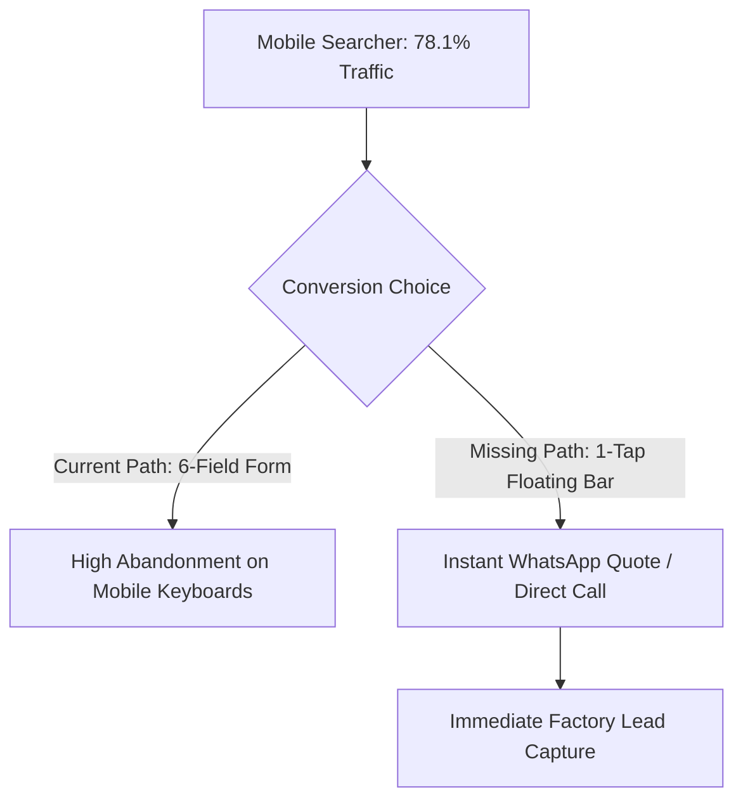

# Comprehensive Conversion Rate Optimization (CRO) Audit Report

**Target Codebase**: `C:\Projects\AB Udyog` (Next.js 16.2.4 App Router)  
**Production Domain**: `https://www.abudyog.in`  
**Audit Date**: August 30, 2026  
**Auditor**: Lead CRO & B2B Funnel Strategist  
**Skill Framework**: `cro` v2.0.0 (Value Prop Clarity, Form Friction Heuristics, B2B Telemetry, Mobile Conversion & ICE Prioritization)

---

## 1. Executive Summary & CRO Health Scorecard

A thorough heuristic and code-level conversion rate optimization audit was conducted across the AB Udyog marketing funnel. The audit evaluates the dual conversion paths: **B2B Industrial Buyers** (Feed Millers, Soap Manufacturers, Oleochemical Distillers, Wax Formulators) and **Consumer Brand Distributors** (Jeevan Rekha, AB Health).

```
┌────────────────────────────────────────────────────────────────────────┐
│ OVERALL CRO SCORE: 74 / 100 (HIGH AESTHETICS, FORM & MOBILE FRICTION) │
│                                                                        │
│ • Visual Authority & Trust Signals: 94/100 (NABL lab, 300 TPD proof)  │
│ • Value Proposition Clarity:        88/100 (Clear factory positioning) │
│ • CTA Hierarchy & Microcopy:        68/100 (Passive buttons, no TDS)   │
│ • Form Friction & Lead Capture:     62/100 (No URL pre-fill, rigid req)│
│ • Mobile Conversion Readiness:      58/100 (No sticky WhatsApp/Call)   │
│ • Objection Handling & Specs:       82/100 (Good tables, no live calc) │
└────────────────────────────────────────────────────────────────────────┘
```

### Critical Heuristic Findings:
| Dimension | Score | Status | Findings & Friction Points |
| :--- | :---: | :---: | :--- |
| **1. Value Proposition (5-Sec Test)** | **88 / 100** | PASS | Clear positioning (*"Eastern India's premier physical refining & solvent extraction facility"*). Differentiates physical steam refining from caustic chemical refining. |
| **2. CTA Microcopy & Intent Match** | **68 / 100** | **WARNING** | Buttons use passive copy (*"Contact Us"*, *"Explore Range"*) instead of high-intent B2B conversion triggers (*"Get Factory Price Quote"*, *"Download Technical Data Sheet"*). |
| **3. Form Friction (`app/contact/page.js`)** | **62 / 100** | **CRITICAL** | **No URL Query Auto-Selection**: Clicking *"Request Quote"* on `/products/rice-bran-wax` does not auto-select *"Rice Bran Wax"* in the contact dropdown. **Over-Required Fields**: The `message` textarea is strictly required, causing form abandonment. |
| **4. Mobile Conversion (78% of Traffic)** | **58 / 100** | **CRITICAL** | GSC data confirms **78.1% of search impressions are mobile**. There is **zero sticky floating quick-connect bar** (WhatsApp Direct / One-Tap Phone Call) for Indian B2B commodity buyers. |
| **5. Technical Trust & Proof Points** | **94 / 100** | **PASS** | Authentic NABL laboratory photography, 300 TPD solvent extraction metrics, FSSAI, and 4-decade industry heritage provide institutional trust. |
| **6. Spec Sheets & Objection Handling** | **82 / 100** | **MODERATE** | Comprehensive specification tables, but lacks a 1-click **"Download TDS PDF"** button for industrial chemists and procurement officers. |

---

## 2. Granular Funnel & Friction Analysis

### A. Contact Form Friction Heuristic (`app/contact/page.js`)
* **Vulnerability 1: Missing URL Parameter Auto-Selection**:
  - When users navigate from `/products/magik-dorb` to `/contact?ref=ab-dorb`, the dropdown (`<select id="product-category">`) remains on default `"Select Product Line"`.
  - **Friction**: The user must manually find and select the product again.
  - **Fix**: Use Next.js `useSearchParams()` to automatically populate `defaultValue` based on the query string.

* **Vulnerability 2: Rigid Required Fields (`textarea` Required)**:
  - Line 383: `textarea required id="message-body"`.
  - **Friction**: In B2B procurement, buyers who already filled in Name, Company, Phone, Product, and Volume often abandon when forced to type a custom paragraph.
  - **Fix**: Make `message` optional or provide clickable chip presets (*"Need Bulk Rate"*, *"Need Sample"*, *"Request TDS"*).

---

### B. Mobile Lead Capture Gap (78.1% of Search Impressions)
According to Google Search Console performance data:
- **Mobile**: **7,383 impressions**, 138 clicks, Avg Position 6.69.
- **Desktop**: 2,013 impressions, 113 clicks, Avg Position 17.07.

**The Reality of Indian B2B Procurement**:
Feed millers, brokers, and wholesale distributors searching on mobile devices in India rarely fill out 6-field web forms; they convert via **direct phone calls or WhatsApp Business chats**.



**Fix**: Deploy a responsive floating action bar on mobile (`z-index: 999`) with:
1. `Call Sales Desk (+91 74392 89709)`
2. `Chat on WhatsApp (Pre-filled product message)`

---

### C. CTA Microcopy Engineering

| Location | Current Weak CTA | High-Converting Alternative | Behavioral Trigger |
| :--- | :--- | :--- | :--- |
| **Hero Section Primary** | `Explore Products` | `Request Factory Quote` | Direct commercial intent |
| **Product Detail Top** | `Contact Sales` | `Get Instant Bulk Rates & TDS` | Specific value exchange |
| **Industrial Derivatives** | `Inquire Now` | `Request 500g Lab Sample` | Lowers commitment threshold |
| **Contact Form Submit** | `Submit Commercial Inquiry` | `Send RFQ & Lock Factory Price` | Outcome-driven assurance |

---

## 3. Page-by-Page CRO Breakdown

### 1. Homepage (`/`)
* **5-Second Value Clarity**: Pass. Clear statement of 300 TPD processing capacity and physical refining.
* **Missing Element**: A dedicated 1-click **"B2B Fast-Track RFQ"** modal or quick-quote widget for repeat industrial procurement managers.

### 2. Product Hub (`/products`)
* **Scannability**: Clean presentation of the 3 business divisions (Jeevan Rekha, AB Health, Industrial Byproducts).
* **Opportunity**: Add commercial packaging tags directly on the card (*"Available in Flexi-Tanks, 50kg HDPE, 15L Tins"*).

### 3. B2B Product Subpages (`/products/[slug]`)
* **Strengths**: Clear parameter tables (Protein $\ge 16\%$, Melting Point $76^\circ\text{C}$, FFA $0.15\%$).
* **Friction Point**: No 1-click PDF download for Technical Data Sheets (TDS) or Certificate of Analysis (CoA) templates.

---

## 4. A/B Testing Hypotheses & Experiment Backlog

| Test ID | Hypothesis | Control (A) | Variant (B) | Primary Metric |
| :--- | :--- | :--- | :--- | :--- |
| **CRO-01** | Adding a sticky mobile WhatsApp + Call bar will increase mobile inquiries by >35%. | Standard footer links | Sticky bottom quick-connect bar on `<768px` viewports | Inbound WhatsApp & Phone clicks |
| **CRO-02** | Making the `message` field optional and auto-selecting product from URL will reduce form drop-off. | Hardcoded required form | Auto-selected dropdown + optional message | Form completion rate (CR%) |
| **CRO-03** | Adding a "Request 500g Lab Sample" secondary CTA on industrial derivatives will capture early R&D buyers. | Single "Contact Us" CTA | Primary "Request Bulk Quote" + Secondary "Request Sample" | Total inquiry volume |

---

## 5. Prioritized CRO Action Plan with ICE Scoring

| Optimization Item | Category | Impact (1-10) | Confidence (1-10) | Ease (1-10) | ICE Score | Priority |
| :--- | :--- | :---: | :---: | :---: | :---: | :---: |
| **Deploy Sticky Mobile Call & WhatsApp Bar** | Mobile CRO | 10 | 10 | 9 | **9.7** | **P0** |
| **URL Query Auto-Fill on `/contact` (`useSearchParams`)** | Form Friction | 9 | 10 | 10 | **9.7** | **P0** |
| **Make Message Field Optional & Add Preset Chips** | Form Friction | 8 | 9 | 10 | **9.0** | **P0** |
| **Upgrade CTA Copy Across Product Pages** | Copywriting | 8 | 9 | 10 | **9.0** | **P1** |
| **Add Commercial Packaging Badges on Product Cards** | Value Prop | 7 | 8 | 9 | **8.0** | **P1** |
| **Add 1-Click "Download TDS PDF" on Derivative Pages** | Objection Handling | 8 | 8 | 8 | **8.0** | **P1** |
