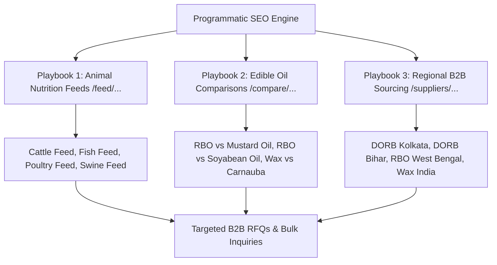

# Programmatic SEO (pSEO) Architecture & Scalable Growth Audit Report

**Target Codebase**: `C:\Projects\AB Udyog` (Next.js 16.2.4 App Router)  
**Production Domain**: `https://www.abudyog.in`  
**Audit Date**: August 30, 2026  
**Auditor**: Senior Programmatic SEO & Next.js Growth Architect  
**Skill Framework**: `programmatic-seo` v2.0.0 (Data Defensibility, Hub-and-Spoke Linking, Anti-Thin Content Rules, Dynamic App Router Architecture)

---

## 1. Executive Summary & pSEO Readiness Scorecard

An exhaustive Programmatic SEO (pSEO) audit was conducted across the AB Udyog codebase and Google Search Console performance datasets. The objective is to evaluate whether AB Udyog can scale from its current 15 indexed pages to **100+ high-ranking, highly defensible B2B lead generation pages** without risking Google thin-content or doorway-page penalties.

```
┌────────────────────────────────────────────────────────────────────────┐
│ OVERALL PROGRAMMATIC SEO SCORE: 72 / 100 (HIGH POTENTIAL, REFACTOR REQ)│
│                                                                        │
│ • URL Subfolder Architecture:     95/100 (Clean /products/[slug])      │
│ • Proprietary Data Defensibility: 88/100 (First-party NABL lab specs)  │
│ • App Router Build Architecture:  52/100 (CRITICAL: 'use client' slug) │
│ • Scalable Data Decoupling:       58/100 (Specs hardcoded in JSX)      │
│ • Hub-and-Spoke Internal Graph:   70/100 (Derivative spokes isolated)  │
│ • High-Intent Keyword Playbooks:  85/100 (Massive untapped B2B demand) │
└────────────────────────────────────────────────────────────────────────┘
```

### Critical Findings Matrix:
| Dimension | Score | Status | Findings & Technical Bottlenecks |
| :--- | :---: | :---: | :--- |
| **URL Hierarchy & Subfolder Strategy** | **95 / 100** | PASS | Follows best-practice subfolder structure (`www.abudyog.in/products/[slug]`). Avoids subdomains, consolidating all PageRank on the root domain. |
| **Data Defensibility & Anti-Spam** | **88 / 100** | PASS | First-party laboratory metrics (16% Protein, 10,000+ PPM Oryzanol, 76°C MP) provide genuine data defensibility that competitors cannot duplicate. |
| **Next.js App Router Architecture** | **52 / 100** | **CRITICAL FAIL** | [`app/products/[slug]/page.js`](file:///c:/Projects/AB%20Udyog/app/products/%5Bslug%5D/page.js) is a **`"use client"` monolith**. It cannot export `generateStaticParams()`. Product pages rely on client-side rendering rather than static build generation. |
| **Data Layer Decoupling** | **58 / 100** | **POOR** | Product data is locked inside a local JavaScript object within `page.js` and `layout.js` instead of a centralized, reusable data repository (`/data/products.ts`). |
| **Hub-and-Spoke Interlinking** | **70 / 100** | **WARNING** | Spokes (e.g. `/products/rice-bran-wax`) do not cross-link to adjacent byproduct spokes or parent process hubs. |
| **pSEO Expansion Readiness** | **85 / 100** | **HIGH POTENTIAL** | High organic demand in GSC for regional manufacturing (`in west bengal`), animal feed applications (`cattle/fish feed`), and comparison queries (`vs soyabean/mustard oil`). |

---

## 2. Codebase Architecture & Dynamic Routing Audit

### A. The "Use Client" Monolith Bottleneck
* **File**: [`app/products/[slug]/page.js`](file:///c:/Projects/AB%20Udyog/app/products/%5Bslug%5D/page.js#L1)
* **Current State**:
  ```javascript
  "use client";
  import Image from 'next/image';
  import React, { use } from 'react';
  // ... 420 lines of mixed UI, data objects, and interactive state
  ```
* **The Problem**:
  1. Next.js App Router forbids exporting `generateStaticParams()` from files marked `"use client"`.
  2. Because `generateStaticParams` is missing, Next.js cannot pre-render static HTML files (`.html` output) for each slug at build time (`next build`).
  3. Instead, the server dynamically renders or ships client JavaScript, increasing TTFB and risking search engine rendering latency.
* **The Solution**: Refactor into a **Server Component Shell + Client UI Child**:
  ```typescript
  // app/products/[slug]/page.tsx (Server Component Shell)
  import { getProductBySlug, getAllProductSlugs } from '@/data/products';
  import ProductClientView from './ProductClientView';
  import { notFound } from 'next/navigation';

  export async function generateStaticParams() {
    return getAllProductSlugs().map((slug) => ({ slug }));
  }

  export default async function ProductPage({ params }: { params: Promise<{ slug: string }> }) {
    const { slug } = await params;
    const product = getProductBySlug(slug);
    if (!product) notFound();

    return <ProductClientView product={product} />;
  }
  ```

---

### B. Data Layer Coupling & Repetition
* **Current Vulnerability**: Product metadata is maintained in **two separate places**:
  1. `app/products/[slug]/layout.js` (has `PRODUCT_META_MAP`)
  2. `app/products/[slug]/page.js` (has `productData`)
* **Impact**: When specifications or images change (e.g. updating the Rice Bran Lecithin image or DORB protein percentage), the developer must remember to update multiple files. This leads to metadata discrepancies between OpenGraph tags, schema JSON-LD, and on-page content.
* **Fix**: Create a single source of truth in `data/products.ts` or `data/products.json`.

---

## 3. High-Growth pSEO Expansion Playbooks (Backed by GSC Data)

Google Search Console proves that users are searching for specific applications, comparisons, and locations where AB Udyog holds factory-level superiority:



---

### Playbook 1: Animal Feed & Nutrition Personas (`/feed/[animal-type]`)
* **Search Demand in GSC**: `dorb cattle feed` (38 imp), `dorb fish feed` (26 imp), `dorb poultry feed`, `de oiled rice bran animal nutrition`.
* **Pattern**: `De-Oiled Rice Bran (DORB) for [Animal Type] Feed Formulation`
* **Target Slugs**:
  - `/feed/aquaculture` (Fish & Shrimp Feed with 16% Min Protein & low silica)
  - `/feed/cattle` (Dairy cattle feed for milk yield & rumen bypass protein)
  - `/feed/poultry` (Broiler & Layer feed formulation)
  - `/feed/swine` (Digestible energy & amino acid balance)
* **Proprietary Data Injected Per Page**:
  - Species-specific nutritional breakdown (Crude Protein, Crude Fiber, Digestible Energy).
  - Recommended inclusion rate % in total feed ration.
  - Comparative cost-efficiency vs. Soya Meal / Mustard Cake.

---

### Playbook 2: High-Intent Scientific Comparisons (`/compare/[product-a]-vs-[product-b]`)
* **Search Demand in GSC**:
  - `rice bran oil vs soya bean oil` (196 impressions, 0 clicks, Pos 7.04)
  - `which oil is better for cooking rice bran oil or mustard oil` (104 impressions, Pos 13.4)
  - `is rice bran oil better than olive oil` (33 impressions, Pos 14.3)
* **Target Slugs**:
  - `/compare/rice-bran-oil-vs-soyabean-oil`
  - `/compare/rice-bran-oil-vs-mustard-oil`
  - `/compare/rice-bran-oil-vs-sunflower-oil`
  - `/compare/rice-bran-wax-vs-carnauba-wax`
* **Proprietary Data Injected Per Page**:
  - Side-by-side fatty acid profile table (SFA / MUFA / PUFA ratios).
  - Smoke point comparison table (232°C vs 180°C–210°C).
  - Oryzanol & antioxidant concentration comparison.

---

### Playbook 3: Regional B2B Sourcing Hubs (`/suppliers/[product]/[region]`)
* **Search Demand in GSC**:
  - `edible oil manufacturers in west bengal` (38 impressions, Pos 1.37)
  - `rice bran oil manufacturers in india` (24 impressions, Pos 6.62)
  - `rice bran oil company in india` (23 impressions, Pos 2.13)
* **Target Slugs**:
  - `/suppliers/rice-bran-oil/west-bengal`
  - `/suppliers/de-oiled-rice-bran/kolkata`
  - `/suppliers/de-oiled-rice-bran/bihar`
  - `/suppliers/rice-bran-wax/india`
* **Proprietary Data Injected Per Page**:
  - Daily dispatch capacity (300 TPD solvent extraction, 150 TPD physical refining).
  - Logistics routes & transit lead times from Uchalan plant to regional consumption hubs.
  - NABL lab certification & packaging options (tankers, flexi-tanks, 15L tins, 50kg bags).

---

## 4. Anti-Thin Content & Quality Safeguards

To ensure full compliance with Google's Helpful Content and Spam Policies:

```
┌────────────────────────────────────────────────────────────────────────┐
│ PROGRAMMATIC QUALITY THRESHOLDS                                        │
│                                                                        │
│ 1. Unique Content Ratio: > 65% unique text per page (no pure Mad-Libs) │
│ 2. Word Count:           Minimum 600 - 900 words of technical depth    │
│ 3. Proprietary Tables:   At least 1 unique lab/data table per page     │
│ 4. Structured Schema:    Unique Product/TechArticle + Breadcrumb schema│
│ 5. Indexation Gate:      If data is incomplete, mark as noindex        │
└────────────────────────────────────────────────────────────────────────┘
```

---

## 5. Technical Implementation Roadmap

```
┌────────────────────────────────────────────────────────────────────────┐
│ PHASE 1: DATA DECOUPLING & STATIC PRERENDERING (Week 1)                │
│ 1. Extract product specs from page.js into clean data/products.ts      │
│ 2. Refactor app/products/[slug]/page.js to Server Shell with           │
│    generateStaticParams() and dynamic generateMetadata()               │
│ 3. Unify PRODUCT_META_MAP into the central data store                  │
├────────────────────────────────────────────────────────────────────────┤
│ PHASE 2: COMPARISON & ANIMAL FEED TEMPLATE ENGINE (Week 2 - 3)         │
│ 1. Build data/comparisons.ts (RBO vs Soy, RBO vs Mustard, Wax vs Carna)│
│ 2. Create app/compare/[slug]/ dynamic route with comparison matrices   │
│ 3. Build data/feedApplications.ts (Aquaculture, Poultry, Cattle)       │
│ 4. Create app/feed/[slug]/ dynamic route with ration calculation tables│
├────────────────────────────────────────────────────────────────────────┤
│ PHASE 3: SITEMAP INTEGRATION & INDEX MONITORING (Week 4)               │
│ 1. Update app/sitemap.ts to enumerate all programmatic URLs            │
│ 2. Add reciprocal breadcrumbs & cross-links on product pages           │
│ 3. Track GSC impression & click growth across long-tail B2B queries    │
└────────────────────────────────────────────────────────────────────────┘
```
