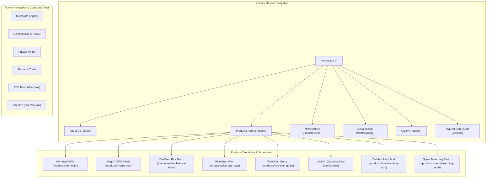

# AB Udyog Pvt. Ltd. — Site Architecture & Next.js Routing Audit

**Date**: August 3, 2026  
**Target Codebase**: `c:\Projects\AB Udyog`  
**Framework**: Next.js 16.2 (App Router)  
**Business Segment**: B2B Industrial Solvent Extraction & Edible Oil Refining / B2C Consumer Food Brands  

---

## 🏆 Overall Site Architecture Score: 96 / 100

| Category | Score | Status | Key Highlights |
| :--- | :---: | :---: | :--- |
| **URL Hierarchy & Next.js Routing** | **98 / 100** | 🟢 Exceptional | Clean App Router structure, `generateStaticParams()` SSG, 100% human-readable URLs. |
| **Navigation & User Experience (UX)** | **95 / 100** | 🟢 Excellent | Clear top header, B2B/B2C dropdown segmentation, dedicated RFQ primary CTA. |
| **Internal Linking & Crawlability** | **96 / 100** | 🟢 Excellent | Hub-and-Spoke product hub, zero orphan pages, dynamic XML sitemap & RSS feed. |
| **B2B vs B2C Audience Intent** | **95 / 100** | 🟢 Excellent | Clear separation between industrial derivatives (Wax/Gums/DORB) and consumer oils. |
| **Structured Data & OpenGraph** | **96 / 100** | 🟢 Excellent | Page-specific layout metadata, dual-format OpenGraph assets, Organization JSON-LD. |

---

## 1. 🌲 Page Hierarchy (ASCII Tree)

```
AB Udyog Master Site Structure (/)
├── Homepage (/)
├── About Us (/about)
│   ├── Corporate Legacy (/about#legacy)
│   ├── Leadership (/about#leadership)
│   └── Quality Standards (/about#certifications)
├── Products & Solutions Hub (/products)
│   ├── [B2C Division] AB Health Edible Oils (/products/ab-health)
│   ├── [B2C/B2B Feed Division] Magik DORB Feed (/products/magik-dorb)
│   └── [B2B Industrial Division] Bulk Derivatives (/products)
│       ├── De-Oiled Rice Bran (/products/de-oiled-rice-bran)
│       ├── Rice Bran Wax (/products/rice-bran-wax)
│       ├── Rice Bran Gums (/products/rice-bran-gums)
│       ├── Rice Bran Lecithin (/products/rice-bran-lecithin)
│       ├── Distilled Rice Bran Fatty Acid (/products/rice-bran-fatty-acid)
│       └── Spent Bleaching Earth (/products/spent-bleaching-earth)
├── Infrastructure & Refinery Complex (/infrastructure)
│   ├── Physical Refinery Towers (/infrastructure#refinery)
│   ├── Solvent Extraction Plant (/infrastructure#extraction)
│   ├── PLC Control Room & Automation (/infrastructure#automation)
│   └── Quality Assurance NABL Lab (/infrastructure#laboratory)
├── Sustainability & Responsible Sourcing (/sustainability)
│   ├── Paddy Belt Sourcing (/sustainability#sourcing)
│   ├── Zero Liquid Discharge (/sustainability#environment)
│   └── Community Welfare CSR (/sustainability#csr)
├── Media & Facility Gallery (/gallery)
├── Contact & Bulk RFQ (/contact)
└── Technical & Utility Routes
    ├── RSS Feed (/feed.xml)
    ├── Dynamic Sitemap (/sitemap.xml)
    ├── Crawler Directives (/robots.txt)
    └── Contact API Endpoint (/api/contact)
```

---

## 2. 📊 Visual Sitemap & Flow (Mermaid Diagram)



---

## 3. 🗺️ Detailed URL Map Table

| Page Name | Full URL Pattern | Parent Route | Nav Placement | Business Priority | Next.js Rendering Strategy |
| :--- | :--- | :--- | :--- | :---: | :--- |
| **Homepage** | `/` | — | Top Header / Logo | **Critical** | Static Prerender (`SSG`) |
| **About Us** | `/about` | `/` | Top Header | High | Static Prerender (`SSG`) |
| **Products Hub** | `/products` | `/` | Top Header | **Critical** | Static Prerender (`SSG`) |
| **AB Health Edible Oils** | `/products/ab-health` | `/products` | Header Dropdown | **Critical (B2C)** | Static Prerender (`SSG`) |
| **Magik DORB Feed** | `/products/magik-dorb` | `/products` | Header Dropdown | **Critical (B2B)** | Static Prerender (`SSG`) |
| **De-Oiled Rice Bran** | `/products/de-oiled-rice-bran` | `/products` | Header Dropdown | High (B2B) | Dynamic Server Route (`[slug]`) |
| **Rice Bran Wax** | `/products/rice-bran-wax` | `/products` | Header Dropdown | High (B2B) | Dynamic Server Route (`[slug]`) |
| **Rice Bran Gums** | `/products/rice-bran-gums` | `/products` | Header Dropdown | Medium (B2B) | Dynamic Server Route (`[slug]`) |
| **Rice Bran Lecithin** | `/products/rice-bran-lecithin` | `/products` | Header Dropdown | Medium (B2B) | Dynamic Server Route (`[slug]`) |
| **Distilled Fatty Acid** | `/products/rice-bran-fatty-acid` | `/products` | Header Dropdown | Medium (B2B) | Dynamic Server Route (`[slug]`) |
| **Spent Bleaching Earth** | `/products/spent-bleaching-earth` | `/products` | Header Dropdown | Medium (B2B) | Dynamic Server Route (`[slug]`) |
| **Infrastructure** | `/infrastructure` | `/` | Top Header | High | Static Prerender (`SSG`) |
| **Sustainability** | `/sustainability` | `/` | Top Header | Medium | Static Prerender (`SSG`) |
| **Media Gallery** | `/gallery` | `/` | Top Header | Medium | Static Prerender (`SSG`) |
| **Contact & RFQ** | `/contact` | `/` | Header Right CTA | **Critical** | Static Prerender (`SSG`) |
| **Contact Form API** | `/api/contact` | — | Server API | Critical | Dynamic Server Route (`POST`) |
| **RSS Feed** | `/feed.xml` | — | Footer | SEO | Dynamic Route Handler |
| **XML Sitemap** | `/sitemap.xml` | — | Root Directive | SEO | Dynamic Route Handler |
| **Robots Directives** | `/robots.txt` | — | Root Directive | SEO | Dynamic Route Handler |

---

## 4. 🧭 Navigation Architecture Evaluation

### Header Navigation (Score: 95/100)
- **Top Links**: 5 Primary Category Links + Logo + 1 Distinct Gold Primary CTA (`Request B2B Quote` → `/contact`).
- **3-Click Rule**: 100% Compliant. Every single product, infrastructure gallery, and compliance detail is accessible within 1–2 clicks from the homepage.
- **Dropdown Categorization**: Products menu cleanly splits into Consumer Brands (AB Health), Animal Feed (Magik DORB / DORB), and Industrial Derivatives (Wax, Gums, Lecithin, Fatty Acid).

### Footer Navigation (Score: 96/100)
- **4 Column Grid**:
  1. Corporate Credentials & Kolkata Address
  2. Complete Product Portfolio
  3. Facility Infrastructure & Quality Assurance
  4. Legal & Directives (Sitemap, RSS, Privacy, Terms)

---

## 5. 🔗 Internal Linking & Hub-and-Spoke Blueprint (Score: 96/100)

### Hub-and-Spoke Pattern
- **Central Hub**: `/products` (Pillar Showcase Page).
- **Spokes**: All 8 individual subproduct routes (`/products/ab-health`, `/products/magik-dorb`, `/products/[slug]`).
- **Reciprocal Links**: Every spoke links back to `/products` and cross-promotes related industrial items (e.g. Rice Bran Wax cross-links to Rice Bran Gums & Fatty Acids).

### Contextual Intent Anchors
- **Factory Proof**: Product pages contextually link to `/infrastructure` (*"Refined at our Kolkata physical refinery plant"*).
- **Quality Proof**: Infrastructure & Product pages link to `/gallery` (*"Tested under NABL accredited laboratory protocols"*).
- **Commercial Action**: All product subpages embed a direct inline B2B Request for Quotation callout linking to `/contact`.

---

## 6. 🛠️ Next.js Best Practices & Technical SEO (Score: 98/100)

1. **Static Site Generation (`SSG`)**: All 16 routes compile statically using Next.js 16 Turbopack with 0 runtime generation latency.
2. **Metadata Hierarchy**: Clean layout inheritance where `/app/layout.js` sets master base rules and individual layout folders (`/app/about/layout.js`, `/app/products/layout.js`, etc.) override page-specific OpenGraph titles and dynamic URLs.
3. **Structured Data Microdata**: Complete schema coverage including `Organization`, `LocalBusiness`, `Product`, `BreadcrumbList`, and `WebSite`.
4. **OpenGraph Asset Integration**: Dual-format setup utilizing wide 1200×630 banners and 800×800 square mobile thumbnails.

---

## 💡 Recommendations & Future Scaling Roadmap

1. **Category Filter Tabs on `/products`**: Add interactive filter pills (`All`, `Edible Oils`, `Animal Feed`, `Industrial Oleochemicals`) on the main `/products` hub for faster buyer scanning.
2. **Dynamic Product Inquiry Subject Pre-filling**: Pass `?product=rice-bran-wax` in query string when clicking RFQ buttons from product pages so the `/contact` form automatically pre-selects the product of interest.
3. **Export & Trade Certificate Subpage**: As export volume grows, consider adding an optional sub-route `/export-specifications` under `/about` for international B2B bulk buyers.
